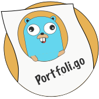

# Portfoli.go

<p align="center">
    
</p>

The simple and flexible portfolio template written witgh [Go](https://golang.org) and [Bootstrap](https://getbootstrap.com)
Build your portfolio with simple yaml files!

**See the live example on [bossm8.ch](https://bossm8.ch)** 

This template can be used for either hosting a static webpage with e.g. 
[GitLab](https://docs.gitlab.com/ee/user/project/pages/) / [GitHub](https://pages.github.com) pages. Or if you
like, with a server written in go, this server brings benefits like a contact form to send emails directly
to you via the portfolio page.

## Configuration

The portfolio template expects its content to come from yaml configuration files.
Those files need to be in a single directory and their names must be the same as the 
content type they represent (with the `.yml` extension).

The following content types are currently supported:

* experience
* education
* projects
* certifications

Each of them might support a different configuration, for possible values and explanaiton see `examples/configs`.

### Recommendations

I recommend putting your custom content into a subdirectory of `public/img` (e.g. `custom`), and referncing
this directory then specifying images in the `yaml` configurations. This makes it easier for the usage with e.g. Docker. 
You are able to use a relative path starting with `/static` i.e. `/static/img/custom/avatar.jpg` the rendering process will 
make sure that any base path (specified with `-srv.base`) of your server is prepended to this path (e.g. when hosing on GitLab pages).


## Usage

There are different approaches on how to use this template, select the one which might fit you the most.
(`Live` means you use the binary to serve the portfolio, which enables the contact form.)

* [Live (Source)](#build-from-Source)
* [Live (Docker)](#docker)
* [Static (GitLab/GitHub)](#gitlab--github-pages)
* [Static (local)](#local)

### Build from Source 

Pull this repository and build the portfoli-go binary with `make build`, then use
the help message to see available options:

```bash
portfoli-go -help
```

### Docker

There exists a pre-build Docker image which you can use to host the portfolio website 
just mount your custom content and configurations to use:

```bash
docker run -it --rm \
           --name portfoli.go \
           -p 127.0.0.1:8080:8080 \
           -v ${PWD}/configs:/var/www/portfoli.go/configs:ro \
           -v ${PWD}/content:/var/www/portfoli.go/public/img/custom:ro \
           ghcr.io/bossm8/portfoli-go:latest
```

There is also an example `docker-compose.yml` in the `examples` directory.

### Static Build

As stated earlier, you are able to build the portfolio for being hosted as a static website.
The static build can be used on e.g. [GitLab](https://docs.gitlab.com/ee/user/project/pages/) 
or [GitHub](https://pages.github.com) pages.

It can be built by using the `-dist flag` with the binary or locally with `make dist`, this will output
the content for being served with a static file server in the specified output directory.
However, when using the binary you need to make sure to also copy over the contents of the directory
`public` into the dist path (see for example the `script` in `examples/.gitlab-ci.yml`). 
As described in the [config](#recommendations) section, I recommend putting 
custom images into a subdirectory of `public/img` and specifying the corresponding path in the yaml configs.

#### GitLab / GitHub Pages

For building with GitLab or GitHub you may use the Docker image of portfoli.go (ghcr.io/bossm8/portfoligo:latest) 
as there is everything prepared inside, just have a repository with your custom content and yaml configuration
which you can use to build the static website. There are pipeline configurations examples for bothin the `examples` directory.
Just copy one them over to your repository containing configuration files and custom content and run the pipeline
(some adjustemts might be needed though - e.g. `BASE_PATH`).

#### Local

For running locally, there is an example [nginx](https://nginx.com) configuration which shows how the dist build may be used.
The command below starts this configuration with the nginx [Docker container](https://hub.docker.com/_/nginx) - 
it assumes you have run `make dist` before and that you have copied your custom content into the `dist` directory.

```bash
docker run -it --rm -p 8080:80 \
           --name porfoli.go \
           -v ${PWD}/dist:/usr/share/nginx/html:ro \
           -v ${PWD}/examples/nginx.conf:/etc/nginx/conf.d/default.conf:ro \
           nginx:latest
```

## Development

There is a [devcontainer](https://code.visualstudio.com/docs/devcontainers/containers) 
setup (which can also be used for building the binary). Simply fork (or clone) this repository,
open the devcontainer with [VSCode](https://code.visualstudio.com/) and run `make setup`.

## Authors

* [bossm8](https://github.com/bossm8)

## TODO

* Write tests